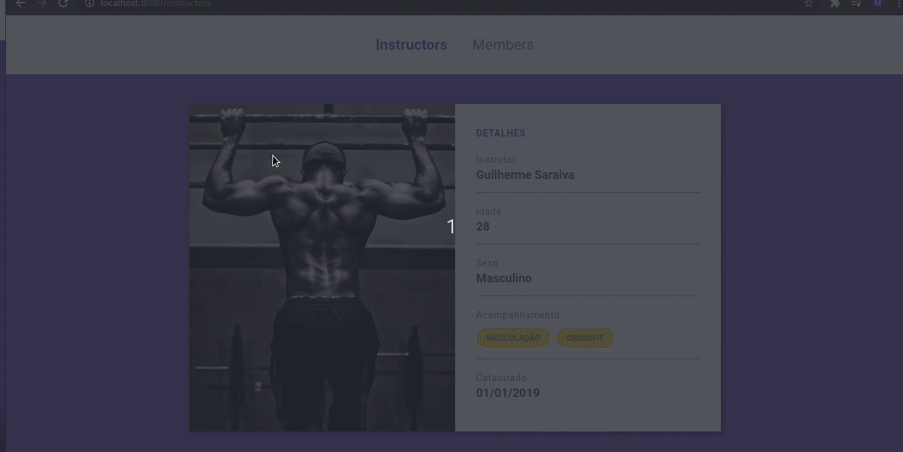

# Projeto Bootcamp Rocketseat - Controle de Academia

> Projeto desenvolvido em aulas do 'Módulo 4' - Professor Mayk Brito

Desenvolver um Gerenciador de Academias. No projeto, vamos criar uma área de cadastro tanto de usuários como de instrutores.

 ## Tecnologias e ferramentas:

 <ul>
  <li>Javascript</li>
  <li>HTML</li>
  <li>CSS</li>
  <li>NodeJS</li>
  <li>Nodemon</li>
  <li>Express</li>
  <li>Nunjucks</li>
 </ul>

## Rodando o projeto:

1 - Clone o projeto e o abra utilizando seu editor preferido.

2 - Rode um `npm install` na pasta do projeto.

3 - Rode um `npm start` para rodar o projeto.

4 - Abra o projeto em `localhost:8080`

## Passos do desenvolvimento:

- Separando as rotas;
- Criando rotas de Instrutores;
- Configuração CSS do 'menu' com animação;
- Configuração CSS do 'card' com animações;
- Estruturar e estilizar dados do instrutor;

- Estruturando dados de instrutores;
- Estruturando a visualização de um instrutor;
- Conhecendo o Spread Operator do Javascript;
- Ajustando sexo e serviços do instrutor;
- Criando lógica para calcular idade;

## Como contribuir:

-  Faça um fork do projeto;
-  Crie uma nova branch, exemplo: `git checkout -b my-feature`;
-  Commit as modificações, exemplo: `git commit -m 'feat: My new feature'`;
-  Faça um push para a sua branch: `git push origin my-feature`;

-  Buscando instrutor com parâmetros da rota;

Criado por Manfrinne Ferreira [Contato](https://www.linkedin.com/in/manfrinne-ferreira-6033121a7/)
